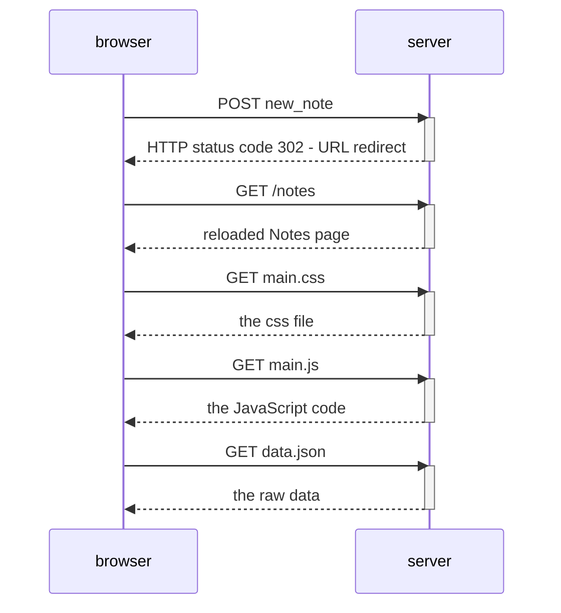

```mermaid
sequenceDiagram
    participant browser
    participant server

    browser->>server: POST new_note
    activate server
    server-->>browser: HTTP status code 302 - URL redirect
    deactivate server

    browser->>server: GET /notes
    activate server
    server-->>browser: reloaded Notes page
    deactivate server

    browser->>server: GET main.css
    activate server
    server-->>browser: the css file
    deactivate server

    browser->>server: GET main.js
    activate server
    server-->>browser: the JavaScript code
    deactivate server

    browser->>server: GET data.json
    activate server
    server-->>browser: the raw data
    deactivate server

```
