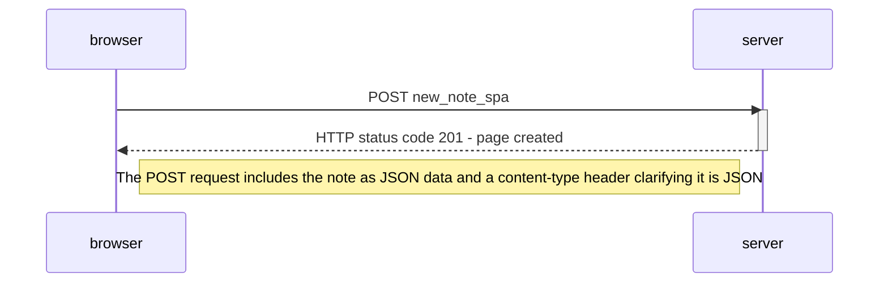

```mermaid
sequenceDiagram
    participant browser
    participant server

    browser->>server: POST new_note_spa
    activate server
    server-->>browser: HTTP status code 201 - page created
    deactivate server
    Note right of browser: The POST request includes the note as JSON data and a content-type header clarifying it is JSON

```
